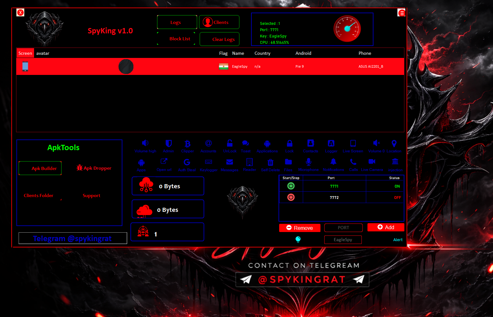
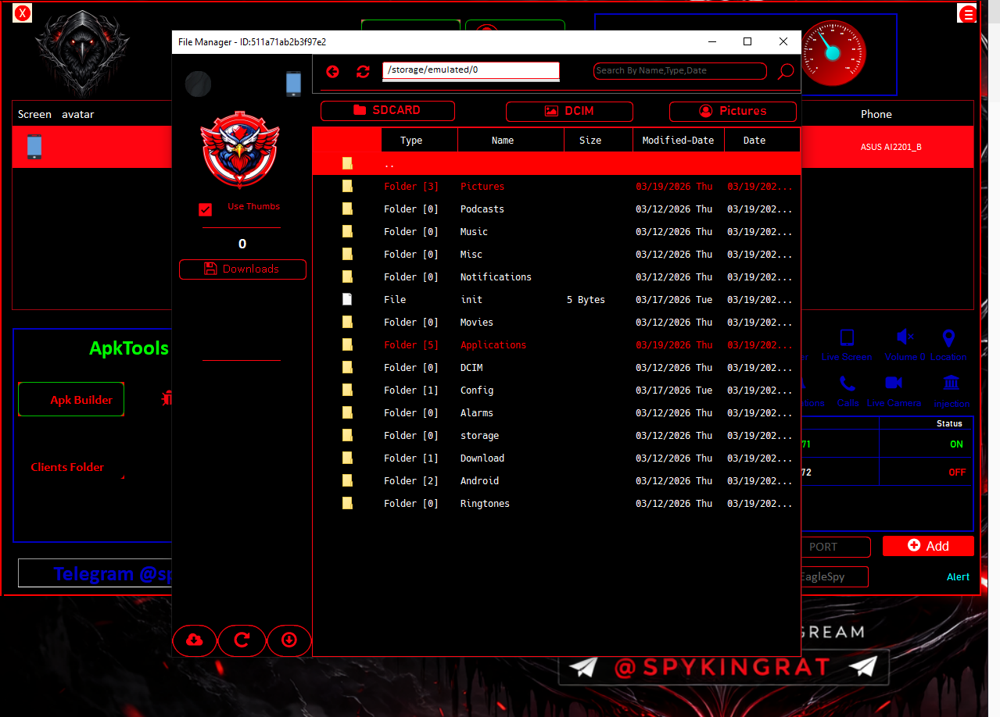
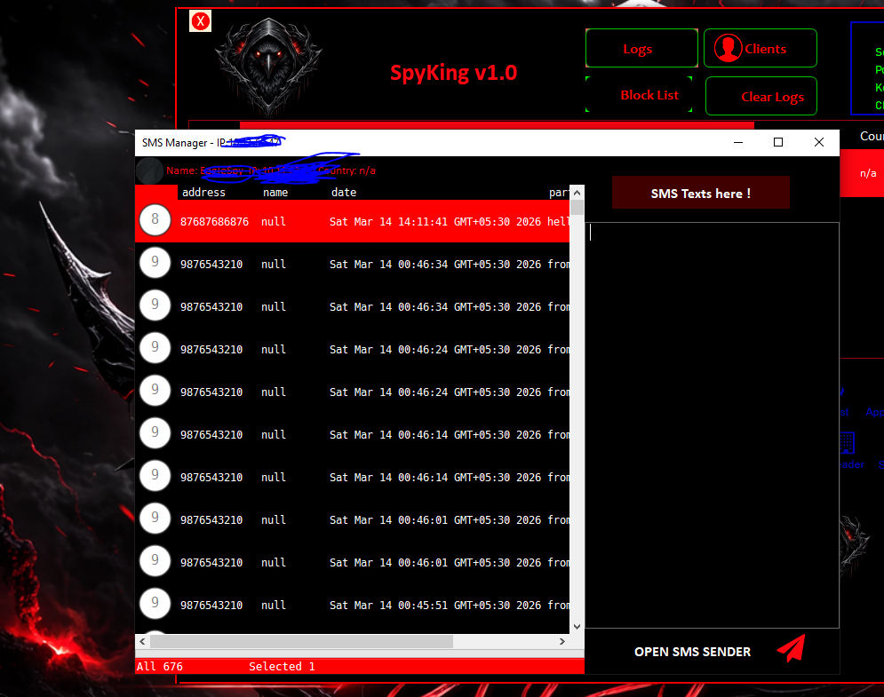
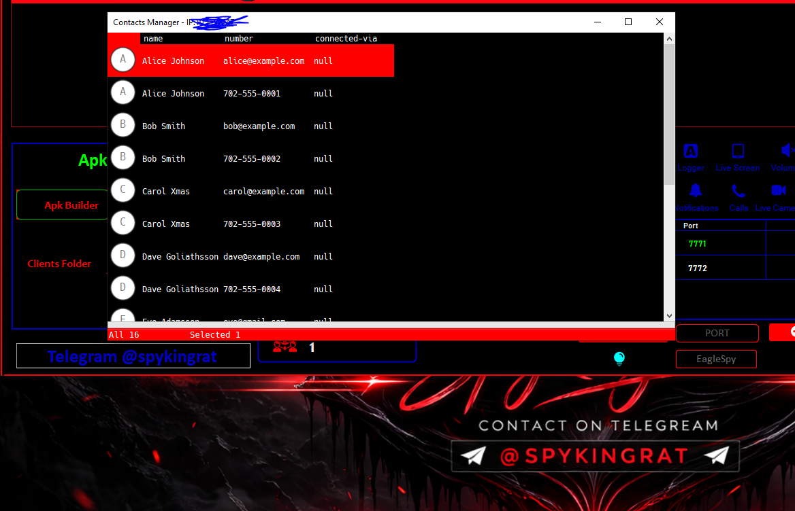
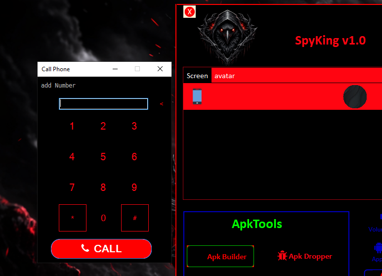
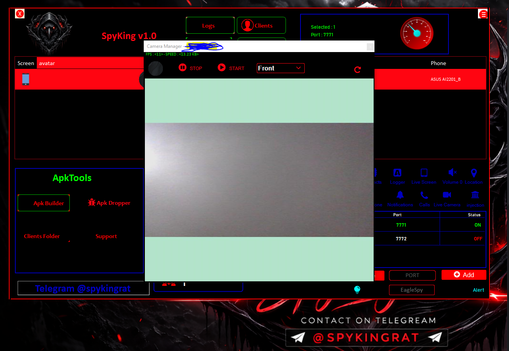
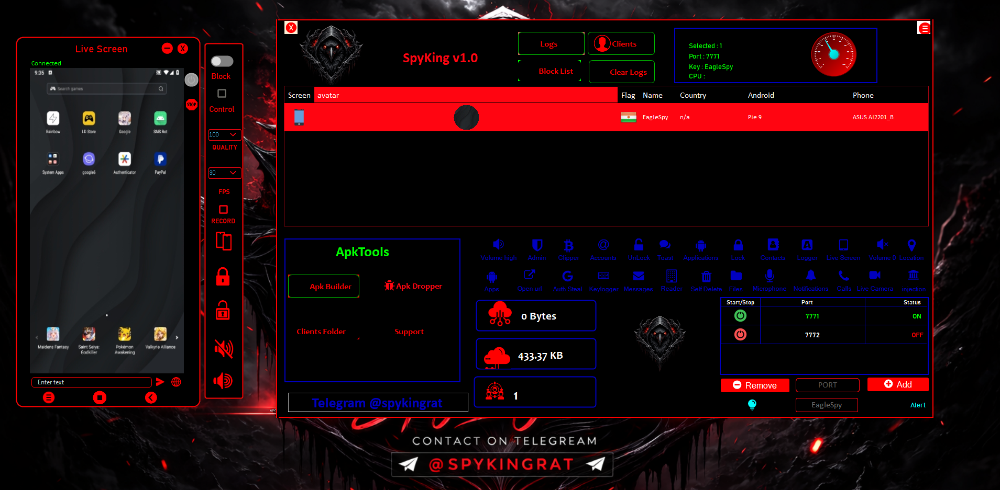
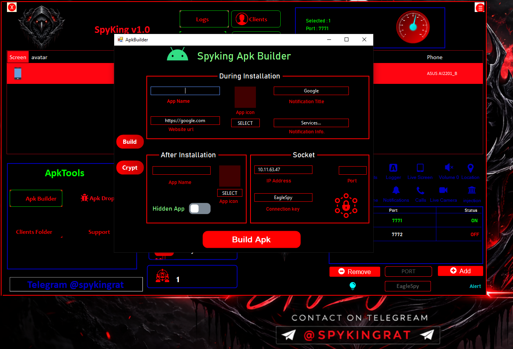

# SpyKing — Advanced Android Remote Control Tool (Website Snapshot)

This README mirrors the website content and includes images from the site gallery.

> SpyKing — Control Your Android Phone From PC

---

## Hero

**SpyKing - The Most Powerful Android Remote Tool 2026**

Control Your Android Phone From PC Like Never Before

[Buy Now](https://t.me/spykingrat) • [Contact Us](https://t.me/spykingrat)

---

## Tested on Android Versions

Android 5 — 17

---

## Features (Highlights)

- File Management (Delete/Upload/Download, Encrypt/Decrypt)
- SMS & Communication (OTP grabber, monitor SMS)
- Call Management (history, make calls)
- Contacts & Accounts access
- Application Control (list, uninstall, open, stop)
- Banking & Security features
- Monitoring (camera, live screen, HVNC, microphone)
- Utility Tools (APK builder, messages, phone info)

---

## Gallery

### Control Panel

### File Access

### SMS Monitoring

### Contacts Access

### Call Control

### Camera Access

### Live Screen Control

### APK Builder

(Other images included in `images/` folder.)

---

## Why Choose SpyKing?

Powerful features, secure & reliable, optimized performance, easy to use, real-time data.

---

## Contact

Telegram: [@spykingrat](https://t.me/spykingrat)

---

*This file is an auto-generated snapshot of the website content for the repository.*
