# 🔥 SpyKing - The Most Powerful Android Remote Control Tool 2026

<div align="center">

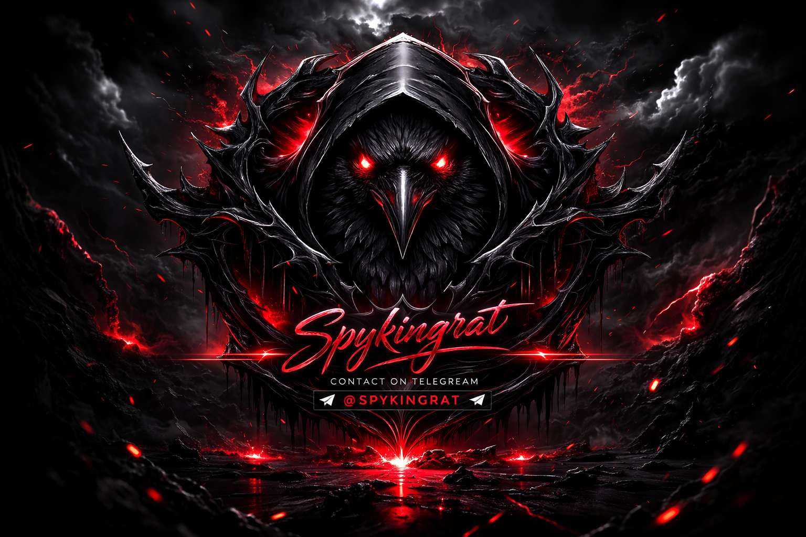

[](https://www.android.com/)
[](https://github.com)
[](LICENSE)
[](https://t.me/spykingrat)

**Control Your Android Phone From PC Like Never Before**

[📱 Features](#features) • [🖥️ System Requirements](#system-requirements) • [📸 Screenshots](#screenshots) • [💬 Contact Us](#contact-us)

</div>

---

## 📋 Table of Contents

- [Overview](#overview)
- [Key Features](#key-features)
  - [File Management](#file-management)
  - [SMS Management](#sms-management)
  - [Call Control](#call-control)
  - [Application Management](#application-management)
  - [Account Access](#account-access)
  - [Monitoring Tools](#monitoring-tools)
  - [Advanced Tools](#advanced-tools)
  - [Super Mode Features](#super-mode-features)
- [System Requirements](#system-requirements)
- [Supported Android Versions](#supported-android-versions)
- [Screenshots & Demo](#screenshots--demo)
- [Installation Guide](#installation-guide)
- [How It Works](#how-it-works)
- [Contact Us](#contact-us)
- [License](#license)

---

## 🎯 Overview

**SpyKing** is a revolutionary Android remote control tool that gives you complete access and monitoring capabilities over Android devices. Control files, SMS, calls, applications, accounts, and more from your PC with an intuitive interface and advanced features.

> **⚠️ Warning**: This tool is for educational and authorized access purposes only. Unauthorized access to devices is illegal.

---

## 🌟 Key Features

### 📁 File Management
- 📥 **Download Files**: Retrieve any file from the target device
- 📤 **Upload Files**: Transfer files to the device
- 🗑️ **Delete Files**: Remove unwanted files remotely
- 🔐 **Encrypt/Decrypt**: Secure sensitive files with encryption
- 📹 **Video & Image Access**: Full media library access

```
✓ Support for all file types
✓ Batch operations
✓ Encryption support
✓ Fast transfer speeds
```

### 💬 SMS Management
- 📬 **View All SMS**: Read incoming, outgoing, and OTP messages
- 📱 **Send SMS**: Send messages to any number
- 🔄 **Bulk SMS**: Send SMS to all contacts with one click
- 🛡️ **OTP Grabber**: Automatically capture OTP codes from authenticator
- 📊 **SMS History**: Complete message history tracking

### ☎️ Call Control
- 📞 **Call History**: View complete call logs
- 🔴 **Make Calls**: Call any number remotely
- 📍 **Real-time Call Monitor**: Monitor outgoing/incoming calls
- 📊 **Call Logs**: Detailed call information and statistics

### 📦 Application Management
- 📥 **APK Download**: Download any installed APK
- 🔧 **App Control**: Open, stop, or uninstall applications
- 📊 **App List**: View all installed applications
- ⚙️ **App Info**: Get detailed application information
- 🎯 **Batch Operations**: Manage multiple apps at once

### 🔑 Account Access
- 📧 **Gmail Accounts**: Access all Gmail and email accounts
- 🔐 **Login Credentials**: Retrieve stored account information
- 📊 **Account Details**: View all linked accounts
- 🌐 **Multi-Account Support**: Manage multiple accounts

### 🎥 Monitoring Tools

#### 📷 Camera Control
- 🎬 **Backup Camera**: Stream front-facing camera feed
- 📹 **Main Camera**: Stream rear camera feed
- 📊 **Live Broadcasting**: Real-time camera stream to PC

#### 🖥️ Screen Access
- 📺 **Live Screen View**: Real-time screen mirroring
- 🖱️ **Remote Control**: Control screen/cursor from PC
- 🎭 **HVNC Mode**: Hide screen from user while controlling
- 🔒 **Screen Lock Bypass**: Advanced screen access

#### 🎙️ Audio Monitoring
- 🔊 **Microphone Access**: Listen to live microphone
- 📞 **Call Recording**: Record phone calls
- 🎵 **Sound Capture**: Capture all audio from device

#### ⌨️ Keylogger
- 📝 **Online Keylogging**: Real-time keystroke logging
- 💾 **Offline Keylogging**: Capture keystrokes offline
- 📊 **Keystroke History**: View passwords, PINs, chats
- 🔐 **PIN/Password Capture**: Automatic sensitive data logging

#### 📍 Location Tracking
- 🗺️ **Real-time GPS**: Track device location in real-time
- 📊 **Location History**: View location trail over time
- 🧭 **Coordinate Tracking**: Precise GPS coordinates
- 🚀 **Live Updates**: Continuous location monitoring

### 🛠️ Advanced Tools
- 📥 **APK Download & Install**: Remotely download and install APKs
- 💬 **Message Display**: Show custom messages on device
- 🔗 **Open Links**: Open URLs on target device
- ☎️ **Dial Numbers**: Initiate calls to numbers
- ℹ️ **Device Info**: Retrieve complete device information
- 🏦 **Banking Injection**: Inject legitimate-looking login pages into apps
- 🎫 **2FA Grabber**: Extract 2FA codes from Google Authenticator
- 💰 **Crypto Clipper**: Monitor and hijack clipboard for crypto addresses

### 🚀 Super Mode Features
- 🛡️ **Anti-Kill Protection**: Prevent app termination
- 🗑️ **Anti-Delete Protection**: Block deletion/uninstalling
- 👁️ **Real-time Active App Monitor**: Track current active application
- 🎬 **Auto Screen Recording**: Automatic screen capture
- 🖥️ **VNC Screen Control**: Full remote desktop control
- 📄 **PDF Hacking**: Exploit PDF vulnerabilities
- ⌨️ **Offline Keylogger**: Works without internet connection
- 🔋 **Battery Optimization Bypass**: Prevent app sleep/battery saver
- 🎯 **Victim Retention**: Auto-recovery if connection is lost
- ♿ **Accessibility Service Bypass**: Circumvent Android restrictions
- 🚫 **Chinese Phone Protection Bypass**: Advanced device protections
- 📱 **Persistent Installation**: Survive factory resets
- 🔄 **Auto-Recovery**: Automatically reinstall if removed

---

## 🖥️ System Requirements

### Minimum Requirements
- **OS**: Windows 7 or later (PC)
- **RAM**: 2GB minimum
- **Storage**: 500MB free space
- **Network**: Internet connection required

### Recommended Requirements
- **OS**: Windows 10/11 (64-bit)
- **RAM**: 4GB or higher
- **Storage**: 1GB+ free space
- **Network**: High-speed internet connection
- **Processor**: Intel i5 or equivalent

---

## 🔧 Supported Android Versions

| Version | Status | Compatibility |
|---------|--------|---------------|
| Android 5.0 - 5.1 | ✅ Supported | Full |
| Android 6.0 - 7.x | ✅ Supported | Full |
| Android 8.0 - 9.0 | ✅ Supported | Full |
| Android 10 - 11 | ✅ Supported | Full |
| Android 12 - 13 | ✅ Supported | Full |
| Android 14 - 15 | ✅ Supported | Full |
| Android 16 - 17 | ✅ Supported | Full |

**Tested on**: Android 5.6, 7, 8, 9, 10, 11, 12, 13, 14, 15, 16, 17

---

## 📸 Screenshots & Demo

### Main Control Panel


### File Access & Management


### Camera Control


### SMS Management


### Contacts & Calls


### Account Access
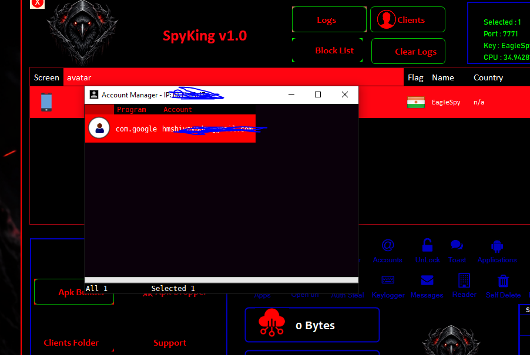

### Keylogger Monitoring
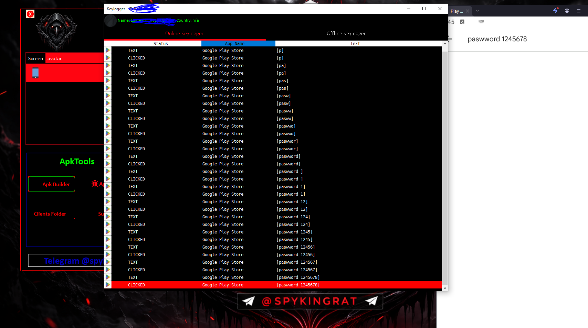

### Screen Control & Streaming
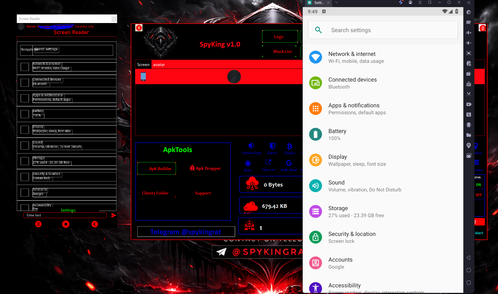
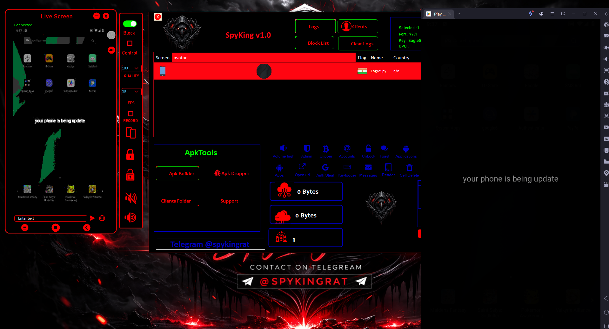

### Location Tracking
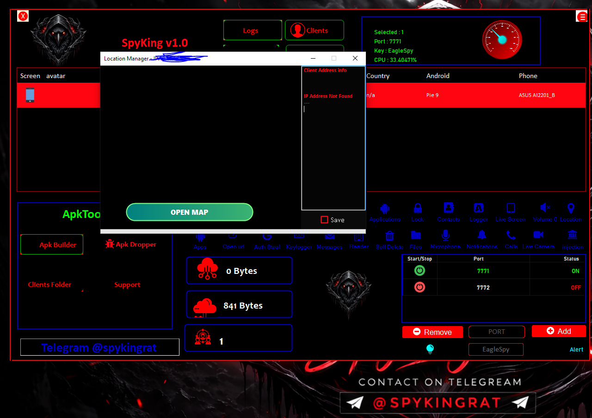

### Microphone Access
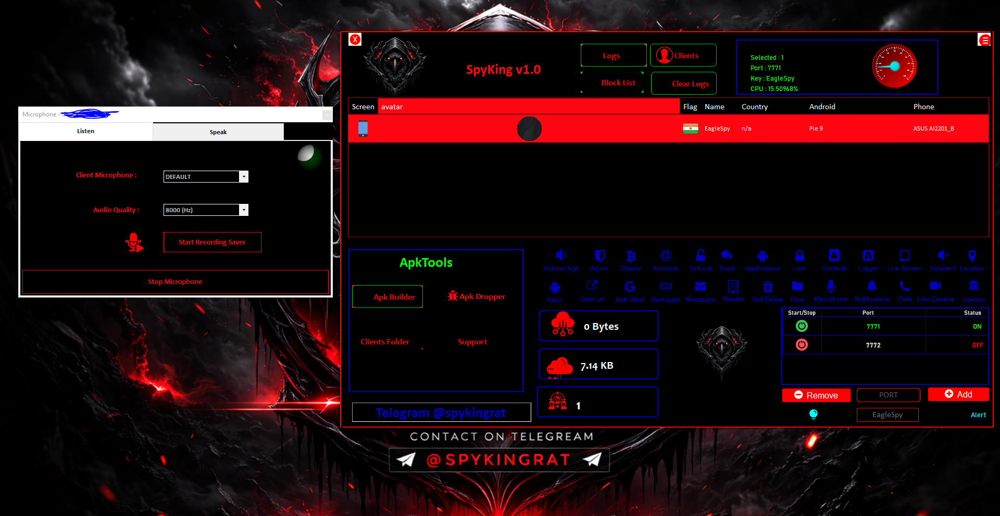

### Advanced Features
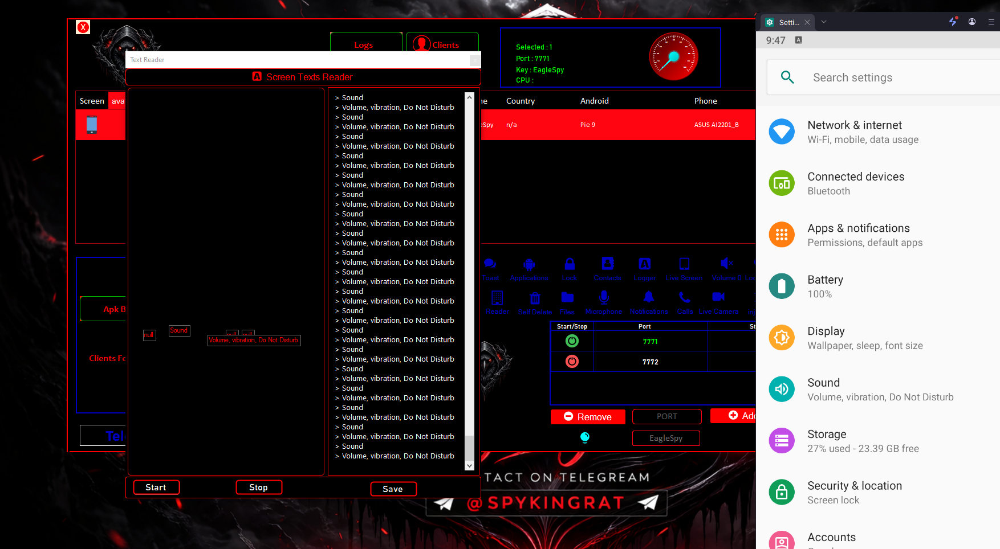
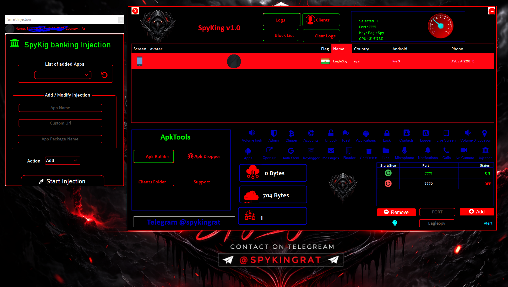
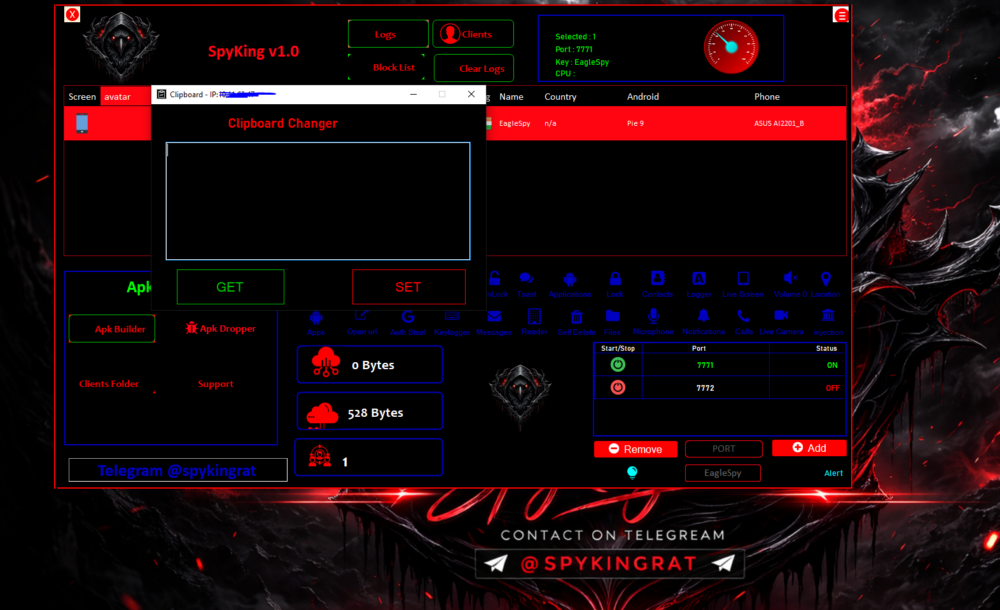


### APK Tools


### Bypass Tools
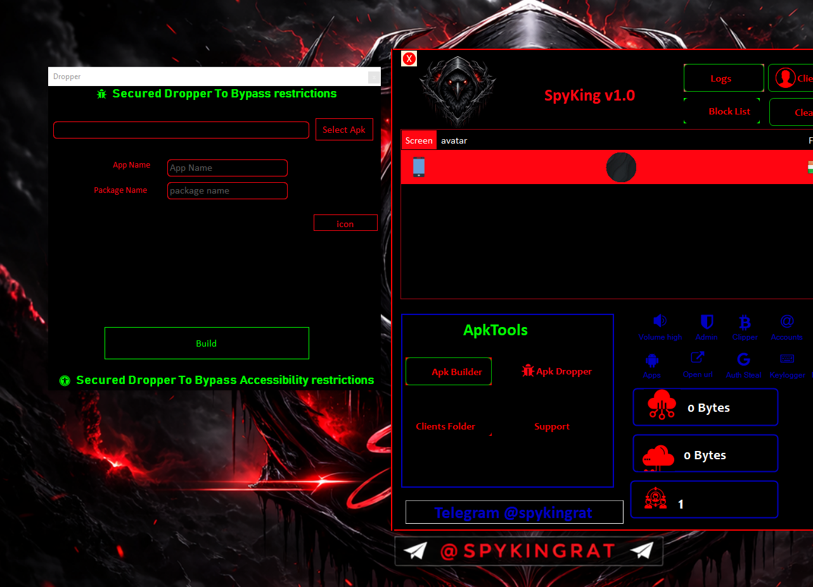

---

## 📥 Installation Guide

### Step 1: Download
Download the latest version of SpyKing from the official Telegram channel.

### Step 2: Extract Files
Extract the downloaded ZIP file to a folder of your choice.

### Step 3: Install Required Components
```bash
# Install .NET Framework (if not already installed)
# Install Visual C++ Redistributable
# Download Android SDK Platform Tools
```

### Step 4: Configure Settings
1. Open the SpyKing application
2. Configure your panel settings
3. Set up database connection
4. Generate APK for target device

### Step 5: Deploy APK
- Transfer the generated APK to the target Android device
- Install the APK on the device
- Grant all necessary permissions
- Tool is now active and ready to use

---

## 🎮 How It Works

### Architecture Overview
```
┌─────────────────────────────────────────────────┐
│          Windows Control Panel (PC)              │
│    - User Interface                             │
│    - Command Processing                        │
│    - Data Display & Management                 │
└────────────┬────────────────────────────────────┘
             │
             │ (Network Communication)
             │
             ▼
┌─────────────────────────────────────────────────┐
│       Android Agent (Target Device)              │
│    - Command Execution                         │
│    - Data Collection                           │
│    - Real-time Monitoring                      │
└─────────────────────────────────────────────────┘
```

### Connection Process
1. **Installation**: Agent APK installed on target device
2. **Registration**: Device registers with control panel
3. **Authentication**: Secure connection established
4. **Control**: Full remote access and monitoring enabled
5. **Persistence**: Auto-recovery and protection enabled

### Data Security
- Encrypted command transmission
- Secure data storage
- Protected credential handling
- Anti-forensic capabilities

---

## 💬 Contact Us

### Get in Touch

**For inquiries, support, and purchase:**

<div align="center">

### 📱 Telegram
[](https://t.me/spykingrat)

</div>

### Contact Information
- **Primary Channel**: [t.me/spykingrat](https://t.me/spykingrat)
- **Support**: Available 24/7
- **Response Time**: Usually within 1 hour
- **Languages**: English, Russian, Hindi, Arabic

### Follow Us
- **Official Telegram**: [@spykingrat](https://t.me/spykingrat)
- **Updates**: Subscribe for latest versions and features
- **Support Group**: Join our community for tips and assistance

---

## ⚠️ Disclaimer

This tool is provided for **educational and authorized testing purposes only**. The developer and distributor are not responsible for:

- Unauthorized access to devices
- Violation of privacy laws
- Illegal activities
- Misuse of the tool
- Any damages caused by improper use

**Users are solely responsible for ensuring they have proper authorization before using this tool on any device.**

---

## 📄 License

**SpyKing** is proprietary software. All rights reserved.

Unauthorized copying, modification, or distribution is prohibited.

---

## 🙏 Credits

Developed with advanced Android security research and penetration testing expertise.

---

<div align="center">

### Version: 2026
**Last Updated**: March 2026

**Made with ❤️ for Advanced Android Control**

[⬆ Back to Top](#-spyking---the-most-powerful-android-remote-control-tool-2026)

</div>

---

## 📊 Feature Comparison

| Feature | Status |
|---------|--------|
| File Management | ✅ Advanced |
| SMS Control | ✅ Complete |
| Call Management | ✅ Full Access |
| Camera Streaming | ✅ Dual Camera |
| Screen Mirroring | ✅ Real-time |
| Keylogging | ✅ Online/Offline |
| Location Tracking | ✅ Live GPS |
| Account Access | ✅ Multi-Account |
| Anti-Detection | ✅ Advanced |
| Account Recovery | ✅ Auto |

---

*Remember: With great power comes great responsibility. Use ethically and legally.*
